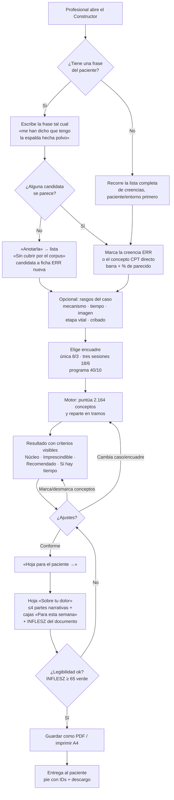
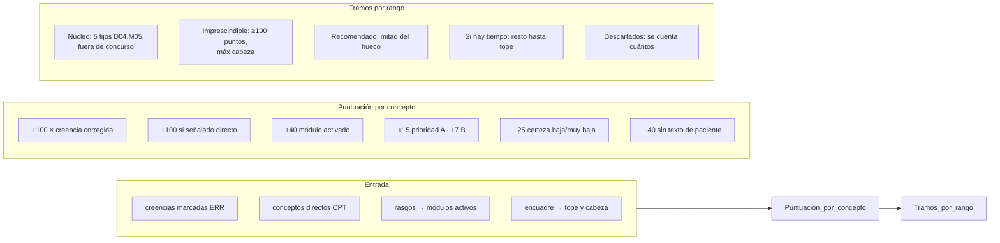
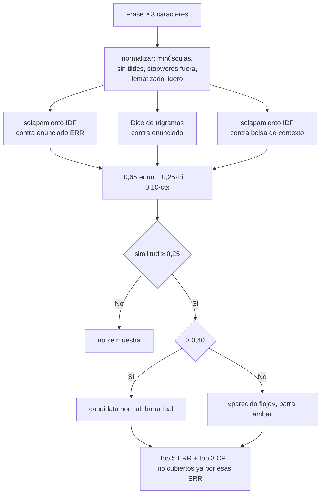
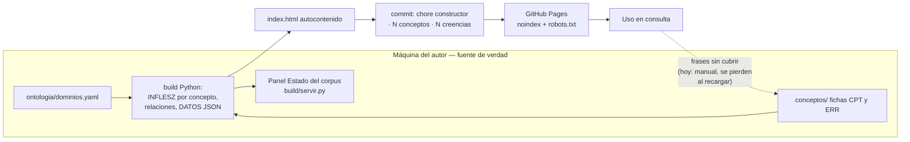

# App Flow · Flujo de la aplicación

**Producto:** Constructor de contenidos · Educación en Dolor
**Versión:** 1.0 · 17/08/2026

---

## 1. Flujo principal: de la frase del paciente a la hoja impresa

## 2. Lógica interna por interacción

Cada cambio de entrada dispara `calcular()`, que re-puntúa todo el corpus:

Desempates: puntos ↓, luego `niv` ↑ (orden pedagógico dentro del módulo),
luego ID. La selección manual (`decidido`) solo guarda lo que el usuario tocó;
lo demás sigue el defecto de su tramo (núcleo e imprescindible entran, el
resto no).

## 3. Flujo de la búsqueda por frase

## 4. Flujo de datos del proyecto (ciclo editorial completo)

La línea discontinua es el eslabón débil del ciclo: la señal «sin cubrir»
—la retroalimentación más valiosa del uso real— no tiene hoy camino de vuelta
al corpus (ver P1 del [PRD](02-PRD.md) y fase 2 del
[plan](07-plan-implementacion.md)).

## 5. Estados y casos borde

| Situación | Comportamiento |
|---|---|
| Nada marcado | Mensaje guía; el núcleo se muestra igualmente (entra siempre) |
| Frase sin candidatas | Oferta de anotarla como sin cubrir |
| Concepto sin `pac` | Visible pero deshabilitado, etiquetado, penalizado −40 |
| Más conceptos que tope | Se cortan por rango y se informa del nº de descartados |
| Parte de la hoja sin conceptos | La sección no se pinta (mejor 3 llenas que 5 vacías) |
| Recarga de página | Estado perdido por diseño (sin persistencia); «Limpiar» equivale |
| Impresión | Solo se imprime la hoja; UI oculta; colores fijados para papel |
