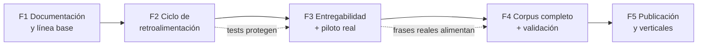

# Plan de implementación

**Proyecto:** Base de Conocimiento en Educación Terapéutica en Dolor
**Versión:** 1.0 · 17/08/2026
**Punto de partida:** 2.164 conceptos (66 % del presupuesto de 3.296) · 385 entregables · 12/15 dominios iniciados · sin validación externa

---

## 0. Lectura de situación

El proyecto no está en fase de arranque sino de **consolidación**: el corpus ha
crecido muy deprisa (215 → 2.164 conceptos entre el 28/07 y el 16/08) y la
herramienta funciona. Los tres desequilibrios que ordenan este plan:

1. **Entregabilidad (la brecha crítica):** solo el 18 % de los conceptos tiene
   texto de paciente; el 82 % del corpus no puede llegar a una hoja.
2. **Ciclo abierto:** la señal «sin cubrir» del uso real no vuelve al corpus.
3. **Validación pendiente:** nada puede llamarse `publicado` todavía.

La regla del propio corpus aplica al plan: *un currículum se define por lo que
se repite, no por lo que cubre* (CPT-00593). Antes profundidad entregable que
anchura de conceptos.

## Fase 1 · Documentación y línea base (esta entrega)

| Tarea | Criterio de cierre |
|---|---|
| Publicar docs 00–07 en el repositorio | PR fusionada |
| Resolver las 4 acciones del cruce PMD ([00](00-PMD-integracion.md) §6): actualizar «Estado del corpus», aclarar 227 vs 223 módulos, definir escala M1–M4, decidir ubicación del PMD canónico | Cada punto cerrado o convertido en ficha del corpus |
| Versionar el generador Python junto al corpus y documentar el comando de build | Otro ordenador puede regenerar `index.html` |

## Fase 2 · Cerrar el ciclo de retroalimentación (2–4 semanas)

| Tarea | Detalle | Criterio de cierre |
|---|---|---|
| Exportación de «sin cubrir» | Botón copiar/descargar `{fecha, frase, candidatas rechazadas}` desde el Constructor | Ninguna frase anotada se pierde al recargar |
| Publicar `datos.json` del panel | El artefacto «Estado del corpus» lee cifras vigentes | Panel y Constructor con el mismo sello de fecha |
| Suite de casos dorados | Tests del buscador (frases reales → ERR esperada), de la puntuación y del INFLESZ, ejecutados en el build | El build falla si cambia un resultado dorado sin quererlo |
| Validadores del contrato | Invariantes de [06 §2.4](06-esquema-backend.md) en el pipeline | Build rojo ante referencias rotas o `leg` incoherente |

## Fase 3 · Entregabilidad y uso real (1–2 meses, solapable con F2)

| Tarea | Detalle | Criterio de cierre |
|---|---|---|
| Redacción dirigida de `pac`/`acc` | Priorizar los conceptos que más puntúan en los 10 casos tipo de consulta (los que hoy salen deshabilitados en imprescindible/recomendado) | En los 10 casos tipo, ningún concepto de los dos primeros tramos aparece «sin texto de paciente» |
| Objetivo cuantitativo de entregabilidad | De 385 a ≥ 800 conceptos entregables, empezando por D01, D04, D09, D10 (prioridad A con vocación de hoja) | ≥ 800 con `ent:true` e INFLESZ por concepto en banda ≥ normal |
| Permalink de caso | Estado serializado en el hash de la URL (sin datos personales) | Un caso puede guardarse y reabrirse |
| Piloto en consulta / EPS Entrevías | Uso semanal registrado: frases sin cubrir recogidas, hojas entregadas, fricciones anotadas | ≥ 20 hojas generadas en condiciones reales + informe breve |
| Peso del fichero | Separar datos del shell o instantánea «solo entregables» si la carga móvil supera ~2 s | Carga aceptable en móvil de gama media |

## Fase 4 · Completar el corpus y validar (3–6 meses)

| Tarea | Detalle | Criterio de cierre |
|---|---|---|
| Dominios a cero | D12 (Docencia), D14 (Recursos y producción), D15 (Salud digital e IA) — por este orden: D12 habilita la vertical de formación | Primeros módulos cerrados en cada uno |
| Dominios incipientes | D10 (38/176), D11 (96/330), D13 (14/212) hasta masa crítica; D13 define el proceso de caducidad de la evidencia | Módulos prioritarios A cerrados |
| Campo de validación | `Concepto.val`: borrador → revisión externa → revisado por personas con dolor → publicado | Esquema en producción y visible en UI |
| Revisión experta externa | Panel revisor por dominios; empezar por el material entregable (las hojas que ya se dan) | Los 5 del núcleo + imprescindibles de los casos tipo con revisión externa |
| Revisión por personas con dolor | Comprensibilidad y tono de las hojas con pacientes reales (metodología a definir con D14) | Primer lote de hojas revisadas; cambios incorporados |
| Referencias expuestas | `Concepto.ref[]` (DOI/PMID) en instantánea profesional | Conceptos publicados citan sus fuentes |

## Fase 5 · Publicación y verticales (a partir de la validación)

- Retirar `noindex` **solo** para el subconjunto `publicado`; mantener la copia
  de trabajo separada.
- Vista de taxonomía para docencia (explorar por dominio/módulo/nivel).
- Materiales derivados con marca (Fundación Paincorp) generados desde el
  corpus, nunca a mano.
- Evaluar entonces —y solo entonces— si alguna necesidad justifica backend
  real (colaboración multi-editor, telemetría consentida).

## Dependencias y camino crítico

El camino crítico pasa por la **validación** (F4): es lo único que desbloquea
la publicación abierta y las verticales con marca. Todo lo anterior está
diseñado para llegar a ella con material que merezca la pena validar y con
evidencia de uso real.

## Riesgos del plan

| Riesgo | Señal temprana | Respuesta |
|---|---|---|
| Seguir ampliando conceptos en vez de entregabilidad | % `ent:true` estancado mientras crece el total | Congelar creación de CPT nuevos salvo los que exijan los casos tipo |
| Piloto sin registro | Hojas entregadas sin anotar sin-cubrir ni fricciones | La exportación de F2 es prerrequisito del piloto |
| Validación infradimensionada | Sin revisores comprometidos al entrar en F4 | Reclutar panel durante F3, no después |
| Bus factor 1 | — (estructural) | F1 y F2 completas reducen el daño: todo reproducible y documentado |
